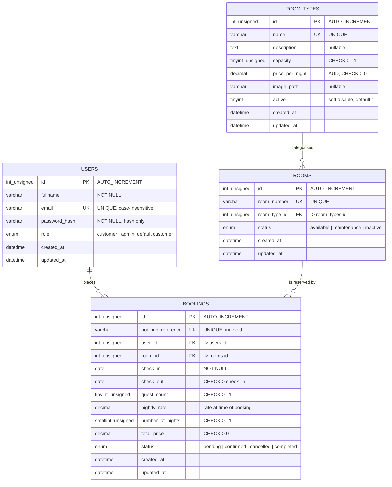

# Database Design

**Hotel Booking System — ICT304 Capstone 2**

This document explains the relational schema defined in
[`../database.sql`](../database.sql): what each table is for, how the tables
relate, and how the design supports registration, room management,
availability searching and bookings.

> **Status:** the schema has been *written* but **not yet executed or tested**
> on this machine — PHP and MySQL were not available in the environment where
> it was authored. No import test, constraint test or query test has been run.
> The application code that will use these tables (registration, login,
> booking, availability) has **not been built yet**. Nothing in this document
> should be read as a claim that the system works end to end.

---

## 1. Design overview

| Property | Value | Reason |
|---|---|---|
| Engine | InnoDB | Required for foreign keys, transactions and row-level locking |
| Character set | `utf8mb4` | Full Unicode, including names outside ASCII |
| Collation | `utf8mb4_unicode_ci` | Case-**insensitive** comparison — essential for email uniqueness |
| Money type | `DECIMAL(10,2)` | Exact decimal arithmetic; `FLOAT` would introduce rounding errors in prices |
| Currency | AUD | Single-currency project; no currency column needed |

Four tables model the system:

```
room_types ──< rooms ──< bookings >── users
```

Read as: one **room type** has many physical **rooms**; one room has many
**bookings**; one **user** has many bookings.

---

## 2. Entity-relationship diagram



---

## 3. Tables

### 3.1 `users`

**Purpose.** Stores every account that can log in. Customers and
administrators live in the same table, distinguished by `role`, rather than in
two separate tables — they share identical attributes, so splitting them would
duplicate structure for no benefit.

| Key | Column(s) | Notes |
|---|---|---|
| Primary key | `id` | Unsigned auto-increment surrogate key |
| Unique key | `email` | Login identifier; enforces one account per address |
| Index | `role` | Supports filtering administrators from customers |

**Design decisions**

- **`email` uniqueness is case-insensitive.** The column uses
  `utf8mb4_unicode_ci`, a case-insensitive collation, so `User@Example.com`
  and `user@example.com` collide on the `uq_users_email` unique key. This is
  the database-level guarantee against duplicate registration; the
  application must still check first so it can return a friendly message
  rather than a raw constraint error.
- **`password_hash`, never a password.** The column stores only the output of
  PHP's `password_hash()`. `VARCHAR(255)` accommodates bcrypt (60 characters)
  and argon2id (~96) with room for future algorithms. Plaintext passwords are
  never persisted.
- **`role` is an `ENUM`** restricted to `customer` and `admin`, so an invalid
  role cannot be stored. It defaults to `customer`, meaning a new registration
  can never accidentally be created with administrative privileges.
- **No account is seeded.** Shipping an administrator with a known password
  would be a security defect, so `users` is empty after import.

> **Resolved in Phase 2:** the original `login.php` read a column called
> `password`, whereas this schema defines `password_hash`. `login.php` has
> since been rewritten and now selects `password_hash`, so the code and the
> schema agree. No table in this schema has a `password` column.

---

### 3.2 `room_types`

**Purpose.** The six bookable categories — their description, capacity and
nightly price. This table is the **single source of truth** for pricing and
occupancy limits, replacing values currently hard-coded across six HTML pages
and inside `booknow.js`.

| Key | Column(s) | Notes |
|---|---|---|
| Primary key | `id` | Unsigned auto-increment surrogate key |
| Unique key | `name` | Prevents duplicate categories; lets seeds reference a type by name |
| Index | `active` | Supports listing only bookable types |

**Design decisions**

- **`capacity` drives the occupancy business rule.** The maximum-guests check
  currently living in JavaScript can be validated server-side against this
  column, so the rule is enforced where it cannot be bypassed.
- **`price_per_night` is `DECIMAL(10,2)`.** Money must be exact; a binary
  floating-point type would accumulate rounding errors across multi-night
  totals.
- **`active` allows soft-disabling.** A room type that is withdrawn from sale
  is flagged inactive rather than deleted, so historical bookings that
  reference it remain intact and readable.
- **`image_path` reuses the existing images.** Paths point at the files
  already in `images/`, so the site's current appearance can eventually be
  reproduced from the database without new artwork.

**Seeded data** (development only, prices in AUD):

| Name | Capacity | Price/night |
|---|---|---|
| Standard Twin Room | 2 | 100.00 |
| Executive Twin Room | 2 | 150.00 |
| Superior Suite | 3 | 200.00 |
| Deluxe Suite | 3 | 250.00 |
| Executive Suite | 3 | 300.00 |
| Presidential Suite | 5 | 500.00 |

---

### 3.3 `rooms`

**Purpose.** Individual, physically bookable rooms. This table is what makes
genuine availability possible.

| Key | Column(s) | Notes |
|---|---|---|
| Primary key | `id` | Unsigned auto-increment surrogate key |
| Unique key | `room_number` | No two rooms share a door number |
| Foreign key | `room_type_id` → `room_types.id` | `ON DELETE RESTRICT`, `ON UPDATE CASCADE` |
| Composite index | (`room_type_id`, `status`) | Availability queries filter on both together |

**Design decisions**

- **Why a separate table from `room_types`?** Without it, "is a Deluxe Suite
  available?" has no meaningful answer — the hotel owns several Deluxe
  Suites, and two guests can both book that category on the same night as
  long as they occupy different physical rooms. Availability must be computed
  per room, not per category. This separation is also the normalisation
  requirement: category attributes (price, capacity, description) belong to
  the type; occupancy belongs to the room.
- **`status` uses an `ENUM`.** A room under `maintenance` or marked
  `inactive` is excluded from availability without deleting it or its booking
  history.
- **`ON DELETE RESTRICT`** blocks deletion of a room type while rooms
  reference it, protecting the `room_types → rooms → bookings` chain.
- **`room_number` is `VARCHAR`, not an integer**, so numbers such as `10A`
  remain possible and leading zeros are preserved.

**Seeded data** (development only): two rooms per type, twelve in total.
The first digit is the floor, and each floor holds one room type.

| Floor | Type | Rooms |
|---|---|---|
| 1 | Standard Twin Room | 101, 102 |
| 2 | Executive Twin Room | 201, 202 |
| 3 | Superior Suite | 301, **302 (maintenance)** |
| 4 | Deluxe Suite | 401, 402 |
| 5 | Executive Suite | 501, 502 |
| 6 | Presidential Suite | 601, 602 |

Room 302 is seeded as `maintenance` deliberately, so that availability logic
can later be demonstrated correctly excluding an out-of-service room.

---

### 3.4 `bookings`

**Purpose.** A reservation of one physical room by one registered user for a
date range. This is the table that replaces the current browser
`localStorage` approach.

| Key | Column(s) | Notes |
|---|---|---|
| Primary key | `id` | Internal identifier |
| Unique key | `booking_reference` | Customer-facing reference; unique **and** indexed |
| Foreign key | `user_id` → `users.id` | `ON DELETE RESTRICT` |
| Foreign key | `room_id` → `rooms.id` | `ON DELETE RESTRICT` |
| Index | (`room_id`, `check_in`, `check_out`) | The availability-search index |
| Index | (`user_id`, `created_at`) | "My bookings, newest first" |
| Index | `status` | Admin filtering by status |
| Index | `check_in` | Date-range reporting |

**Design decisions**

- **`nightly_rate`, `number_of_nights` and `total_price` are stored, not
  recalculated.** The rate is copied from `room_types.price_per_night` at the
  moment of booking. If the hotel later raises its prices, historical
  bookings keep the price the guest actually agreed to. Deriving the total
  from a live join would silently rewrite history.
- **Both foreign keys use `ON DELETE RESTRICT`.** Deleting a user or a room
  that has bookings is refused outright. `CASCADE` would erase booking
  history — unacceptable for records with financial meaning. Removing a
  departed customer or a decommissioned room is handled by status flags, not
  deletion.
- **`status` is an `ENUM`** covering the lifecycle: `pending` on creation,
  `confirmed` by an administrator, `cancelled`, or `completed` after the stay.
- **`booking_reference` is generated server-side.** The current front end
  builds an identifier from `"B" + Date.now()` in the browser, which is
  guessable and forgeable. The unique constraint here is the database-level
  guarantee that two bookings can never share a reference.
- **No payment data.** There is no card number, expiry, CVV or cardholder
  column anywhere in this schema, by design — payment is out of scope.

**Constraints enforced at the database level**

| Constraint | Rule |
|---|---|
| `chk_bookings_dates_ordered` | `check_out > check_in` |
| `chk_bookings_guest_count_positive` | `guest_count >= 1` |
| `chk_bookings_nights_positive` | `number_of_nights >= 1` |
| `chk_bookings_nightly_rate_positive` | `nightly_rate > 0` |
| `chk_bookings_total_price_positive` | `total_price > 0` |

`CHECK` constraints are enforced by MySQL 8.0.16+ and MariaDB 10.2+. Older
servers parse and ignore them, so the application must still validate — the
constraints are a safety net, not a substitute for server-side validation.

---

## 4. Relationships

| Relationship | Cardinality | Foreign key | On delete |
|---|---|---|---|
| `room_types` → `rooms` | One type has many rooms | `rooms.room_type_id` | RESTRICT |
| `rooms` → `bookings` | One room has many bookings | `bookings.room_id` | RESTRICT |
| `users` → `bookings` | One user has many bookings | `bookings.user_id` | RESTRICT |

`bookings` sits between `users` and `rooms`, resolving what is conceptually a
many-to-many relationship (many users reserve many rooms) while carrying its
own attributes — dates, guest count, pricing and status.

**Date convention.** A stay occupies the half-open interval
`[check_in, check_out)`. The guest departs on the morning of `check_out`, so a
new booking may legitimately begin on the day a previous one ends.

---

## 5. How the schema supports each feature

### Registration

`users` holds the account. The case-insensitive unique key on `email` is the
database-level guarantee against duplicate registration — the defect present
in the current `register.php`. `password_hash` stores only a hash, and `role`
defaults to `customer` so no registration can self-elevate to administrator.

### Rooms

`room_types` centralises description, capacity, price and image, so room
information is defined once rather than duplicated across six HTML files.
`rooms` records each physical unit. Together they let room pages eventually be
generated from data, and let a price change take effect in one place.

### Availability

Availability is a query, not a stored flag — a stored "is available" column
would be meaningless without a date range. The intended query shape:

```sql
SELECT r.id, r.room_number, rt.name, rt.price_per_night
FROM rooms r
JOIN room_types rt ON rt.id = r.room_type_id
WHERE rt.id     = ?              -- requested room type
  AND r.status  = 'available'    -- excludes maintenance/inactive rooms
  AND rt.active = 1
  AND rt.capacity >= ?           -- occupancy business rule
  AND NOT EXISTS (
        SELECT 1
        FROM bookings b
        WHERE b.room_id = r.id
          AND b.status IN ('pending','confirmed')   -- cancelled frees the room
          AND b.check_in  < ?      -- requested check_out
          AND b.check_out > ?      -- requested check_in
      );
```

The `(room_id, check_in, check_out)` index on `bookings` serves the `NOT
EXISTS` subquery, and the `(room_type_id, status)` index on `rooms` serves the
outer filter. The overlap test uses strict inequalities so same-day
changeover is permitted.

### Bookings

A booking links a user to a specific room for a date range, with the agreed
price captured at the time of booking. `RESTRICT` on both foreign keys means
booking history cannot be destroyed by deleting related records, and the
`CHECK` constraints reject nonsensical data such as a check-out before
check-in or a zero-guest reservation.

### Administrator access

`users.role` is the mechanism. An administrator dashboard can require a
session whose user has `role = 'admin'`, replacing the current situation
where the dashboard is a static HTML file reachable by anyone. The `role`
index supports listing administrators.

---

## 6. Assumptions

1. **One hotel.** There is no `hotels` table; every room belongs to the same
   property. A multi-hotel platform would need one, plus a `hotel_id` on
   `rooms`.
2. **Single currency (AUD).** No currency code column, and no exchange rates.
3. **Payment is out of scope.** No card, transaction or invoice tables exist,
   deliberately.
4. **Email confirmation is out of scope.** No notification or message queue
   tables.
5. **A booking covers one room.** A guest wanting three rooms creates three
   bookings. A multi-room reservation would require a `booking_rooms` line-item
   table.
6. **Guests must register before booking.** `bookings.user_id` is `NOT NULL`,
   so anonymous booking is not supported. This is a deliberate change from the
   current front end, which collects a name and email as free text with no
   account.
7. **Prices are fixed per room type.** No seasonal rates, weekend loading or
   promotional pricing. Those would need a `rates` table keyed by date range.
8. **No room-level price override.** All rooms of a type cost the same.
9. **Timestamps are server-local.** `DATETIME` is used rather than `TIMESTAMP`;
   for a single-location demonstration hotel, time-zone conversion is not
   required.
10. **Cancelled bookings free the room.** Availability counts only `pending`
    and `confirmed` bookings.
11. **Overlap prevention is enforced in application code**, not by a database
    constraint. MySQL has no exclusion constraint for date ranges, so the
    booking transaction must re-check availability before inserting.

---

## 7. Not yet implemented

To be explicit about what this schema does **not** do on its own:

- Only the `users` table is used by application code so far. `register.php`
  inserts into it and `login.php` reads from it, both with prepared
  statements (Phase 2).
- `room_types`, `rooms` and `bookings` are **not read or written by any code
  yet**. They are defined and seeded, but nothing queries them.
- The availability overlap check described above is a *plan*, not existing
  code.
- The booking form still writes to browser `localStorage`. Nothing reaches
  the `bookings` table.
- No data has been imported, and **no test of this schema has been executed**
  — neither PHP nor MySQL was available in the environment where it was
  written.
