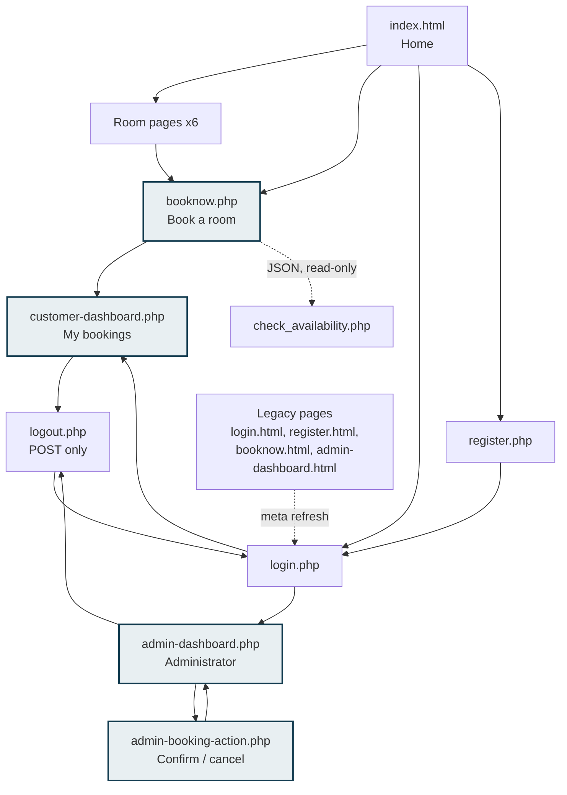

# Front-End Design

**Hotel Booking System — ICT304 Capstone 2**

Evidence document for the front-end (visual design) assessment area. It
records the design decisions taken, the system built to support them, and the
limitations that remain.

> **Scope.** This is supporting evidence, **not** the final 1,500-word
> assessment submission. It documents what was built and why.
>
> **Nothing here has been visually tested.** No page in this project has been
> rendered in a browser by the author — PHP was unavailable in the development
> environment, so the PHP pages could not be executed at all. See
> [Known limitations](#known-limitations).

---

## 1. Design objective

Produce an interface that is credible as a hotel booking system, honest about
being a student demonstration, and usable by everyone.

Specific goals:

| Goal | How it was pursued |
|---|---|
| Professional boutique-hotel feel | Serif display headings, restrained palette, generous whitespace, photography given room to breathe |
| Warm rather than clinical | Warm off-white surfaces and a brass accent instead of pure white and bright blue |
| Clean, not decorative | One accent colour, one rule motif, no ornament that carries no meaning |
| Consistent | A single token file drives every page |
| Accessible | Keyboard operability and contrast treated as requirements, not extras |
| Honest | No invented awards, ratings, reviews, addresses or availability claims |
| Self-contained | No framework, no build step, no CDN, no external fonts |

## 2. Intended users

| User | Needs from the interface |
|---|---|
| **Prospective guest** (not signed in) | Understand what rooms exist, what they cost in AUD, and how to book |
| **Registered customer** | Book a room quickly; see the status of existing bookings |
| **Administrator** | Scan incoming bookings and act on them with confidence |
| **Assessor / marker** | Judge quality, consistency and accessibility quickly, possibly offline |

Assumed conditions: desktop and mobile browsers; keyboard-only and
screen-reader users; a local XAMPP install with no internet connection.

## 3. Site map

Shaded nodes require a session. `admin-dashboard.php` and
`admin-booking-action.php` additionally require the `admin` role.

**No public page links to the administrator dashboard.** The link that used to
sit in the home page navigation was removed in Phase 2.

## 4. Page inventory

| Page | Type | Stylesheets | Access |
|---|---|---|---|
| `index.html` | Public landing | `theme.css`, `index.css` | Anyone |
| `StandardTwinRoom.html` | Room detail | `theme.css`, `room.css` | Anyone |
| `ExecutiveTwinRoom.html` | Room detail | `theme.css`, `room.css` | Anyone |
| `SuperiorSuite.html` | Room detail | `theme.css`, `room.css` | Anyone |
| `DeluxeSuite.html` | Room detail | `theme.css`, `room.css` | Anyone |
| `ExecutiveSuite.html` | Room detail | `theme.css`, `room.css` | Anyone |
| `PresidentialSuite.html` | Room detail | `theme.css`, `room.css` | Anyone |
| `login.php` | Form | `theme.css`, `css.css` | Anyone |
| `register.php` | Form | `theme.css`, `css.css` | Anyone |
| `logout.php` | Confirmation | `theme.css`, `css.css` | Signed in |
| `booknow.php` | Form + transaction | `theme.css`, `booknow.css` | Customer |
| `customer-dashboard.php` | Data table | `theme.css`, `dashboard.css` | Customer |
| `admin-dashboard.php` | Totals + table | `theme.css`, `dashboard.css` | Administrator |
| `check_availability.php` | JSON endpoint | — | Signed in |
| `admin-booking-action.php` | POST handler | — | Administrator |
| `login.html`, `register.html`, `booknow.html`, `admin-dashboard.html` | Legacy redirects | `theme.css`, `css.css` | Anyone |

## 5. Colour palette

Defined once as custom properties in `theme.css`.

| Token | HEX | Role |
|---|---|---|
| `--color-primary` | `#123B4F` | Headers, footers, primary buttons, headings |
| `--color-primary-dark` | `#0C2A38` | Hover state, image scrims |
| `--color-primary-soft` | `#E8EFF2` | Tinted panels, facility chips, table hover |
| `--color-accent` | `#B08544` | Brass rules, card top borders, admin badge |
| `--color-accent-dark` | `#8E6A34` | Accent hover |
| `--color-bg` | `#FAF7F2` | Page background (warm off-white) |
| `--color-surface` | `#FFFFFF` | Cards, panels, table rows |
| `--color-surface-alt` | `#F4F0E9` | Alternating rows, alternate sections |
| `--color-text` | `#1F2523` | Body text |
| `--color-text-muted` | `#5C6360` | Secondary text, labels, hints |
| `--color-text-inverse` | `#FFFFFF` | Text on dark surfaces |
| `--color-border` | `#E2DCD2` | Hairlines |
| `--color-border-strong` | `#C9C0B2` | Input borders |
| `--color-success` | `#1E5F3E` | Confirmed status, success messages |
| `--color-warning` | `#8A5B00` | Pending status, notices |
| `--color-error` | `#8C2020` | Cancelled status, validation errors |

### Contrast

The ratios below were **measured in a browser** against the rendered pages,
by reading the computed colours and applying the WCAG relative-luminance
formula. They are not estimates.

| Pair | Measured | Verdict |
|---|---|---|
| Navigation link on `--color-primary` header | 11.90:1 | Passes AAA |
| Primary button text on its background | 11.90:1 | Passes AAA |
| `h1` / `h2` on `--color-bg` | 11.14:1 | Passes AAA |
| Body text on `--color-bg` | 14.59:1 | Passes AAA |
| `--color-text-muted` on `--color-bg` | 5.77:1 | Passes AA |
| `--color-text-muted` on `--color-surface` | 6.16:1 | Passes AA |
| Hero eyebrow on the hero scrim | 9.30:1 | Passes AAA |
| `--color-accent` on white | 3.34:1 | **Fails AA for body text** |

Caveat: this covers the static HTML pages. The PHP pages could not be
rendered, so their contrast is inferred from sharing the same tokens and
components rather than measured directly.

The brass accent is therefore used **only** for borders, rules and the admin
badge — never for small text on a light background. This was a deliberate
constraint, not an oversight.

The original palette used `#3f22ff` with `#111` button text at roughly 2.6:1,
which was unreadable. That combination has been removed.

### Colour is never the only signal

Booking statuses carry a text label as well as a colour. Invalid form fields
carry a border, a text message and `aria-invalid`. Selected gallery
thumbnails carry `aria-pressed` as well as a border.

## 6. Typography

**System fonts only.** The previous `@import` of Google Fonts was removed so
the site renders identically with no network connection — important when a
marker opens it from a local XAMPP install.

| Token | Stack | Used for |
|---|---|---|
| `--font-serif` | Iowan Old Style, Palatino Linotype, Palatino, Georgia, Times New Roman, serif | `h1`–`h4`, prices, statistics, wordmark |
| `--font-sans` | System UI stack (`-apple-system`, Segoe UI, Roboto, …) | Body text, forms, tables, buttons |

The serif/sans pairing is what carries most of the "boutique hotel" character
without any downloaded asset.

| Token | Size | Typical use |
|---|---|---|
| `--text-xs` | 13px | Badges, labels, footnotes |
| `--text-sm` | 14px | Table text, hints, secondary copy |
| `--text-base` | 16px | Body |
| `--text-lg` | 18px | Lead paragraphs |
| `--text-xl` | 22px | `h3` |
| `--text-2xl` | 28px | `h2` |
| `--text-3xl` | 36px | `h1`, statistics |
| `--text-4xl` | 48px | Hero headline |

`--text-3xl` and `--text-4xl` reduce at 900px so headlines do not overwhelm
small screens. Body copy is capped at `68ch` for readability.

## 7. Spacing and layout

A 4px-based scale: `--space-1` (4px) through `--space-8` (64px). Every margin
and padding in the project uses one of these tokens.

| Token | Value |
|---|---|
| `--max-width` | 1140px — main content column |
| `--max-width-narrow` | 720px — forms and prose |
| `--radius-sm/md/lg/pill` | 4px / 8px / 16px / 999px |
| `--shadow-sm/md/lg` | Three elevation steps |

Layout uses CSS Grid for the room and card grids and Flexbox for the header,
footer and button rows. No float-based layout remains.

## 8. Components

| Component | Where defined | Notes |
|---|---|---|
| Skip link | `theme.css` | Hidden until focused |
| Site header + wordmark | `theme.css` | Identical on every public page |
| Navigation | `theme.css` | `aria-current="page"` marks the current page |
| Buttons | `theme.css` | `primary`, `secondary`, `on-dark`, `ghost-on-dark`, `sm`, `block`; all at least 44px tall |
| Form field | `theme.css` | Visible label, optional hint, error message, `aria-invalid` |
| Flash message | `theme.css` | Success and error variants, `role="alert"` |
| Notice | `theme.css` | Neutral "work in progress" or demonstration callout |
| Panel | `theme.css` | Card container for dashboard sections |
| Status badge | `theme.css` | Four booking statuses |
| Room card | `index.css` | Image, name, capacity, price, action |
| Step list | `index.css` | The four-stage "how booking works" explainer |
| Hero | `index.css` | Static background image, gradient scrim, headline, actions |
| Gallery | `room.css` | Main image plus four thumbnail buttons |
| Room summary | `room.css` | Price, facts, facility chips, actions; sticky on desktop |
| Auth card | `css.css` | Centred card on a photographic background |
| Booking card | `booknow.css` | Form, estimate panel, availability result |
| Data table | `dashboard.css` | Stacks into cards below 640px |
| Totals card | `dashboard.css` | Administrator statistics |

## 9. Responsive breakpoints

| Width | Behaviour |
|---|---|
| > 1000px | Room grid 3 columns; steps 4 across; totals 4 across; room page two-column with sticky summary |
| ≤ 1000px | Steps 2 across; totals 2 across |
| ≤ 900px | Room grid **2 columns**; room page becomes single column; summary stops being sticky; display type reduces |
| ≤ 700px | Header stacks; container padding reduces |
| ≤ 640px | Room grid **1 column**; steps 1 column; totals 1 column; **data tables stack into cards**; gallery thumbnails 2 across; hero shortens |
| ≤ 480px | Auth card padding reduces; fixed background attachment released |

Wide tables sit inside an `overflow-x: auto` wrapper on larger screens, so the
page body itself never scrolls sideways.

## 10. Navigation behaviour

Consistent header across the home page, all six room pages, the booking page
and both dashboards: wordmark on the left (always linking home), navigation on
the right.

- Signed-out pages show Home, Rooms, Book Now, Login, Register.
- Signed-in pages replace Login/Register with a **POST logout form**, never a
  link — logging out changes state, so it must not be a `GET`.
- Room pages carry a "Back to rooms" link returning to `index.html#rooms`.
- The administrator dashboard is never linked from a public page.

## 11. Forms and validation

| Principle | Implementation |
|---|---|
| Visible labels | Every input has a `<label for>`; placeholders are never used as labels |
| Errors near the field | Message rendered immediately after the input |
| Errors announced | `role="alert"` on each message |
| Errors linked | `aria-describedby` points the input at its message |
| Errors machine-readable | `aria-invalid="true"` on the failing input |
| Input preserved | Non-sensitive values are re-filled after a failure; password fields never are |
| Correct keyboards | `type="email"`, `type="date"`, `type="number"` |
| Password managers | `autocomplete="email"`, `current-password`, `new-password` |
| Sensible bounds | `min`/`max` on dates and guests, mirroring the server rules |
| Server is authoritative | Client-side hints never replace PHP validation |

The booking page states this last point in the interface itself: the estimate
panel is labelled "Guide only", and the note explains that price and
availability are calculated on the server at submission.

## 12. Accessibility considerations

| Requirement | Implementation |
|---|---|
| Skip link | On every substantive page |
| Landmarks | `header`, `nav`, `main`, `section`, `aside`, `footer` |
| One `h1` per page | Verified across all pages |
| Focus visible | `:focus-visible` outline, 3px, offset — **replacing** the native outline with a stronger one, never removing it |
| Focus on dark | Switches to white inside headers, footers and the hero |
| Keyboard operable | All controls are native `<a>` or `<button>`; no inline handlers |
| No hover-only content | Room names, prices and links are always visible. Previously they were revealed on `:hover` via `visibility: hidden`, which made them unreachable by keyboard and touch |
| Gallery | Native buttons with `aria-pressed`; Enter and Space work without extra code |
| Live regions | `aria-live="polite"` on the estimate; `role="status"` on the availability result |
| Alt text | Specific per image and per view; decorative thumbnail images use `alt=""` with a visually hidden button label |
| Lazy loading | On room-grid and thumbnail images; the hero is not lazy-loaded |
| Pointer targets | Buttons and nav links at least 44px tall |
| Reduced motion | Honoured globally. The hero is a static image, so nothing moves there at all |
| Tables | `<caption>`, `<thead>`, `scope="col"`; stacked cards on mobile keep column names via `data-label` |
| Language | `lang="en-AU"` on every page |

## 13. Desktop and mobile decisions

**Desktop.** Two-column room pages with a sticky summary keep the price and
booking action visible while the visitor scrolls the photographs. The
administrator table shows all eleven columns at once for scanning.

**Mobile.** The eleven-column booking table would be unusable, so below 640px
each row becomes a card and every value is prefixed with its column name from
`data-label`. The hero shortens so the room grid is reachable without a long
scroll. Fixed background attachment is released, because it is expensive and
can jitter on mobile browsers.

## 14. Tools and technologies

| Area | Technology |
|---|---|
| Markup | HTML5 |
| Styling | CSS3 — custom properties, Grid, Flexbox, media queries, `aspect-ratio` |
| Behaviour | Vanilla JavaScript (ES5-compatible syntax, IIFE-scoped) |
| Server | PHP 8 with mysqli |
| Database | MySQL 8 / MariaDB (InnoDB, utf8mb4) |
| Local server | Apache via XAMPP |
| Version control | Git |
| Fonts | System font stacks only |

No framework, no preprocessor, no bundler, no package manager, no CDN.

## 15. Business rules traced to the interface

| Business rule | Where the interface expresses it | Where it is enforced |
|---|---|---|
| A booking needs check-in **and** check-out | Two `type="date"` inputs, both `required` | `booknow.php` — strict `DateTime` parsing |
| Check-out must follow check-in | `min` on the check-out field; `booknow.js` advances it | `booking_validate_stay()` + a database `CHECK` |
| Check-in cannot be in the past | `min` set to today | `booking_validate_stay()` |
| Maximum stay 30 nights | Stated in the check-out hint | `BOOKING_MAX_NIGHTS` |
| Guests must not exceed room capacity | Capacity shown per option; `max` updated on selection | Re-read from `room_types.capacity` under lock |
| Price = nightly rate × nights | Estimate panel, labelled "Guide only" | Recalculated server-side in integer cents |
| A room cannot be double-booked | Availability button; "no rooms available" error | Locking transaction in `booknow.php` |
| Bookings start as pending | Submit button copy and the note beneath it; pending status badge | Database default |
| Only staff confirm a booking | Confirm/Cancel buttons on the admin dashboard only | `require_admin()` + POST + CSRF |
| One account per email | "An account with this email already exists" | `UNIQUE` key + duplicate check |
| Customers see only their own bookings | Dashboard shows one customer's table | `WHERE b.user_id = ?` from the session |
| Administrators do not place bookings | No booking link in the admin header | `booknow.php` redirects administrators away |
| No payment is taken | Stated on the booking page and the home page | No card fields or columns exist |

## 16. Known limitations

1. **The PHP pages have never been rendered.** PHP was unavailable in the
   development environment, so `booknow.php`, `login.php`, `register.php`,
   `logout.php` and both dashboards have not been executed or viewed. Their
   layout is inferred from sharing `theme.css` and the same components as the
   static pages, not observed.
2. **The static HTML pages were rendered and inspected** over a local HTTP
   server. Verified: the responsive breakpoints (3 / 2 / 1 room columns at
   1280 / 768 / 375px), absence of horizontal overflow at all three sizes,
   the gallery swapping image and alternative text, `aria-pressed` tracking,
   heading counts, alternative-text coverage, and the contrast figures above.
   Full-page screenshots could not be captured (the preview pane was not
   composited), so **no visual review of the overall composition has taken
   place** — only measured properties.
3. **No HTML or CSS validation run.** The W3C validators have not been used.
4. **No screen-reader testing.** ARIA usage follows established patterns but
   has not been confirmed with NVDA, JAWS or VoiceOver.
5. **No cross-browser testing.** Behaviour in Safari, Firefox and older Edge
   is unverified. `aspect-ratio` and `:focus-visible` need reasonably current
   browsers; older ones degrade rather than break.
6. **Room content is still hard-coded.** The six room pages repeat prices and
   capacities in HTML that also exist in `room_types`. They currently agree,
   but a price change in the database would not update the pages.
7. **Image provenance is unknown.** See `ASSET_REGISTER.md` — this is an open
   academic-integrity risk, not a visual one.
8. **Large images are unoptimised.** Several exceed 500 KB and one is 1 MB.
   There is no `srcset`; only `loading="lazy"` mitigates this.
9. **No mobile navigation menu.** Links wrap onto multiple lines on small
   screens rather than collapsing into a toggle. Acceptable at five items, but
   it would not scale.
10. **The home page hero image is decorative.** It is applied as a CSS
    background rather than an ``, so it is correctly absent from the
    accessibility tree and needs no alternative text. It replaced a background
    video that rendered blurry and played back with visible lag; removing it
    also removed a 4.7 MB download from the first page a visitor sees.
